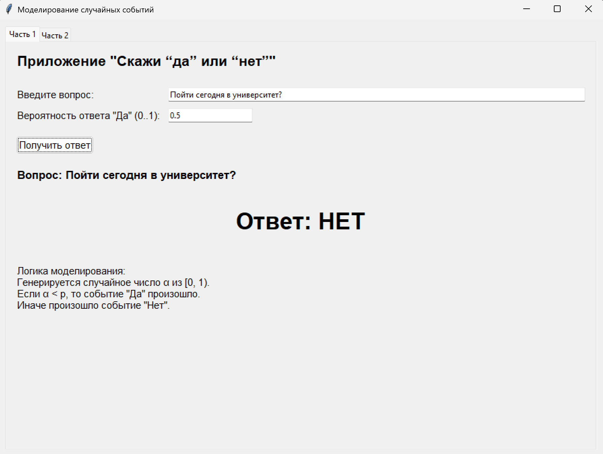
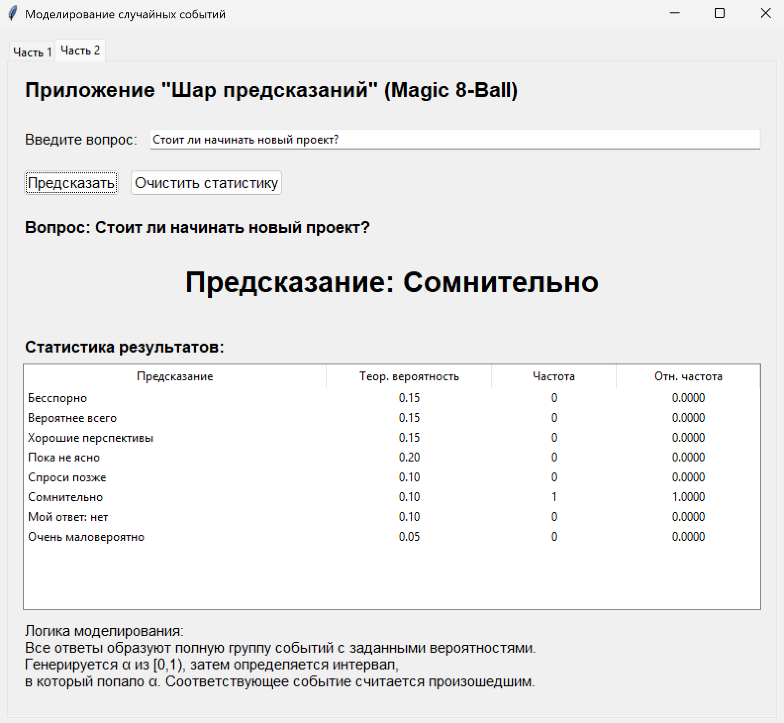

### Моделирование случайных событий (GUI)

#### Задание
- Часть 1: приложение «Да / Нет»
- Часть 2: приложение «Шар предсказаний»

---

## Теория

Используется базовый датчик случайных чисел:
$\[
\alpha \in [0,1)
\]$

Для полной группы событий с вероятностями $\(p_1, \dots, p_m\)$, где
$\[
\sum p_i = 1,
\]$
событие можно выбирать двумя эквивалентными способами.

**1. Метод последовательного вычитания**
1. Генерируется $\(\alpha\)$
2. Последовательно вычитаются вероятности:
   - $\(\alpha := \alpha - p_1\)$
   - $\(\alpha := \alpha - p_2\)$
3. На шаге, где $\(\alpha \le 0\)$, выбирается событие

**2. Метод накопительных сумм**
1. Генерируется $\(\alpha\)$
2. Последовательно строятся суммы:
   - $\(p_1\)$
   - $\(p_1 + p_2\)$
   - $\(p_1 + p_2 + p_3\)$
3. Выбирается первое событие, для которого $\(\alpha\)$ меньше соответствующей накопленной суммы

Оба метода математически эквивалентны и дают одинаковое распределение вероятностей.

---

## Реализация

В программе используется встроенный базовый датчик Python `random.random()`, который генерирует равномерно распределённое число на интервале \$([0,1)\)$.

При этом сам выбор события реализован вручную, без использования `random.choice()` и других готовых средств выбора по вероятностям.

---

### Часть 1 — «Да / Нет»

События:
- «Да» — вероятность $\(p\)$
- «Нет» — вероятность $\(1-p\)$

В этой части реализован **метод последовательного вычитания**:

1. Генерируется $\(\alpha\)$
2. Формируется список событий:
   - («Да», (p))
   - («Нет», (1-p))
3. Из \(\alpha\) последовательно вычитаются вероятности
4. На шаге, где $\(\alpha \le 0\)$, выбирается ответ

Интерфейс:
- ввод вопроса
- ввод вероятности ответа «Да»
- вывод результата

---

### Часть 2 — «Шар предсказаний»

Используется набор из 8 событий с вероятностями:

- Бесспорно — 0.15
- Вероятнее всего — 0.15
- Хорошие перспективы — 0.15
- Пока не ясно — 0.20
- Спроси позже — 0.10
- Сомнительно — 0.10
- Мой ответ: нет — 0.10
- Очень маловероятно — 0.05

В этой части реализован **метод накопительных сумм**:

1. Генерируется $\(\alpha\)$
2. Последовательно накапливается сумма вероятностей
3. Выбирается первое событие, для которого
$\[
\alpha < p_1 + p_2 + \dots + p_k
\]$

То есть во второй части событие определяется по тому, в какой интервал попало значение $\(\alpha\)$.

Дополнительно:
- ведётся статистика (частоты и относительные частоты)

---

## Особенности

- используется `random.random()` как базовый датчик
- выбор события реализован вручную
- `random.choice()` не используется
- в части 1 применяется метод последовательного вычитания
- в части 2 применяется метод накопительных сумм
- оба метода эквивалентны по результату
- добавлена статистика результатов для второй части

---

## Результаты

При большом числе испытаний:

- для «Да / Нет» частоты приближаются к $\(p\)$
- для «Шара предсказаний» частоты приближаются к заданным вероятностям

Отклонения незначительные, что соответствует закону больших чисел.

---

## Выводы

- реализовано два приложения для моделирования случайных событий
- в обеих частях используется базовый датчик $\(\alpha \in [0,1)\)$
- в части 1 выбор события выполнен методом последовательного вычитания вероятностей
- в части 2 выбор события выполнен методом накопительных сумм
- оба метода корректны и эквивалентны с точки зрения вероятностной модели
- требования задания соблюдены: выбор событий реализован алгоритмически, без использования готовых функций случайного выбора

Таким образом, программа является корректной реализацией моделирования случайных событий и демонстрирует два способа выбора события из полной группы исходов.
