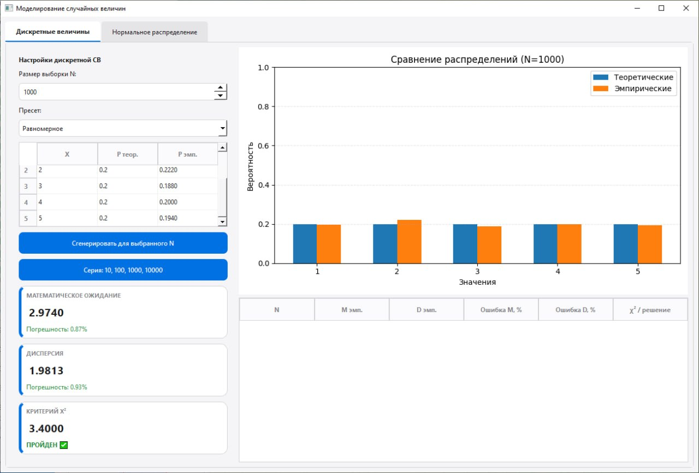
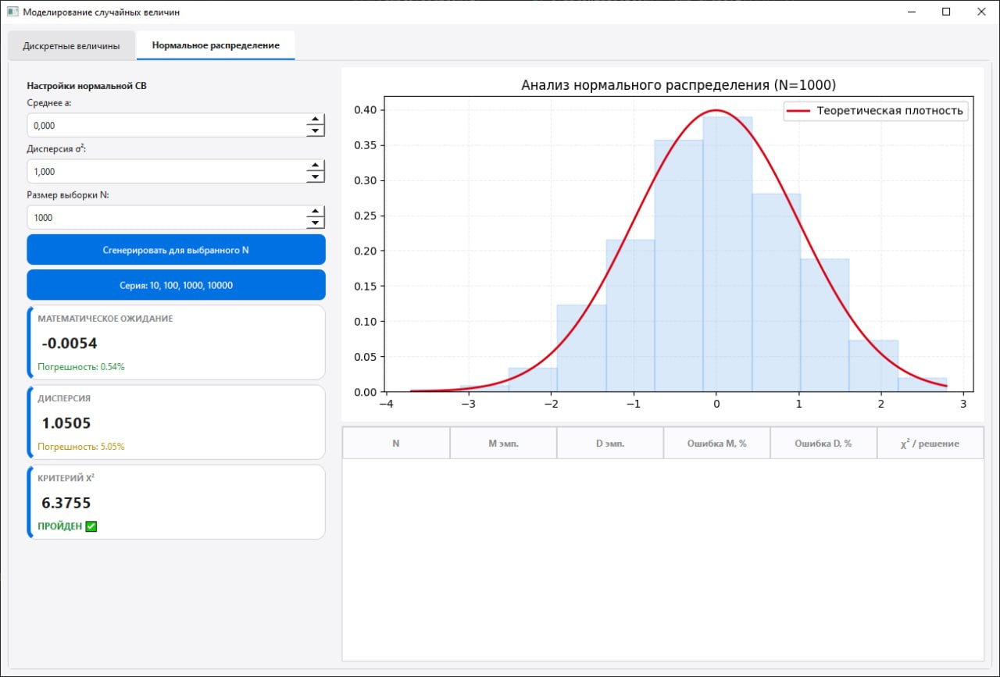

### Имитационное моделирование дискретных случайных величин (GUI)

### 1. Задание:
- реализовать генерацию дискретной случайной величины, заданной рядом распределения;
	- вычислить эмпирические вероятности;
	- вычислить выборочные среднее и дисперсию, их относительные погрешности;
	- вычислить статистику χ² и применить критерий χ² при:
	  - N = 10, 100, 1 000, 10 000;
- Реализовать генератор нормальной случайной величины, 
	- построить гистограммы 
	- сравнить точность моделирования при разных объёмах выборки.
- сделать вывод.

--- 

### 2. Используемые библиотеки

- `numpy` — для вычислений и генерации случайных чисел;
- `math` — для математических функций;
- `matplotlib` — для построения графиков;
- `scipy.stats` — для работы с нормальным распределением и критерием $\chi^2$;
- `PyQt6` — для создания графического интерфейса.

---

### 3. Вероятностные модели и алгоритмы

#### 3.1. Дискретная случайная величина
Пусть ДСВ задана рядом распределения:
$$X = \{x_1, x_2, \dots, x_m\},\quad P = \{p_1, p_2, \dots, p_m\},\quad \sum p_i = 1.$$

- **Теоретическое математическое ожидание:** $M(X) = \sum x_i p_i$.
- **Теоретическая дисперсия:** $D(X) = \sum x_i^2 p_i - M(X)^2$.
- **Эмпирическая вероятность:** $\hat p_i = n_i / N$, где $n_i$ – частота значения $x_i$.
- **Выборочное среднее:** $\bar{x} = \frac{1}{N}\sum x_i$.
- **Выборочная дисперсия (смещённая):** $D^* = \frac{1}{N}\sum (x_i - \bar{x})^2$.
- **Относительная погрешность:** $\delta = \frac{|\theta_{\text{эмп}} - \theta_{\text{теор}}|}{|\theta_{\text{теор}}|}\cdot 100\%$.

**Алгоритм генерации (метод последовательного вычитания):**  
Генерируется $\alpha \sim U(0,1)$. Последовательно вычитаются $p_1, p_2, \dots$ пока $\alpha \le 0$; выбирается соответствующее $x_i$.

#### 3.2. Нормальная случайная величина
Плотность нормального распределения:
$$f(x) = \frac{1}{\sigma\sqrt{2\pi}} e^{-\frac{(x-\mu)^2}{2\sigma^2}}.$$

**Генерация методом Бокса–Мюллера:**  
Для двух независимых $U_1, U_2 \sim U(0,1)$:
$$Z = \sqrt{-2\ln U_1} \cdot \cos(2\pi U_2),$$
затем $X = \mu + \sigma Z$, где $\sigma = \sqrt{\sigma^2}$.

#### 3.3. Критерий $\chi^2$ Пирсона (для ДСВ)
Статистика:
$$\chi^2 = \sum_{i=1}^{m} \frac{(n_i - N p_i)^2}{N p_i}.$$
Степени свободы: $df = m-1$. Гипотеза о согласии эмпирического распределения с теоретическим **не отвергается**, если $\chi^2 < \chi^2_{\text{крит}}(0.95, df)$.

---

### 4. Описание приложения

Приложение реализовано на **Python** с использованием **PyQt6**, **NumPy**, **SciPy** и **Matplotlib**. Графический интерфейс содержит две вкладки: «Дискретные величины» и «Нормальное распределение».

#### 4.1. Модуль дискретных величин
- Пользователь вводит значения $X$ и вероятности $P$ в таблицу. Предусмотрены пресеты (равномерное распределение, распределение Бернулли).
- Автоматическая проверка суммы вероятностей; при отклонении от 1 предлагается нормировка.
- Для выбранного $N$ (или для серии $N = 10,100,1000,10000$) генерируется выборка.
- Вычисляются: эмпирические вероятности, выборочное среднее, дисперсия, относительные погрешности, $\chi^2$.
- Результаты отображаются в карточках метрик, на сравнительной гистограмме (теоретические и эмпирические вероятности, ось Y от 0 до 1) и в таблице серий.

#### 4.2. Модуль нормального распределения
- Пользователь задаёт $\mu$ и $\sigma^2$.
- Генерация методом Бокса–Мюллера; поддерживаются одиночный и серийный запуск.
- Вычисляются: выборочное среднее, дисперсия, относительные погрешности, $\chi^2$.
- Отображаются гистограмма выборки и теоретическая кривая плотности.

---

### 5. Результаты моделирования

#### 5.1. Дискретная СВ (равномерное распределение на 5 значениях, $p_i=0.2$)

| $N$ | $M_{emp}$ | $D_{emp}$ | Ошибка $M$, % | Ошибка $D$, % | $\chi^2$ / решение |
|---|---:|---:|---:|---:|---|
| 10 |2.8000 | 2.3600 | 6.67 | 18.00 | 5.0000 / принят |
| 100 | 3.0500 | 1.7275 | 1.67 | 13.63 | 3.3000 / принят |
| 1000 | 3.0580 | 1.9846 |1.93 | 0.77 | 4.4900 / принят |
| 10000 | 2.9937 | 1.9997 | 0.21 | 0.02 | 0.2610 / принят |

#### 5.2. Нормальная СВ ($\mu=0$, $\sigma^2=1$)

| $N$ | $M_{emp}$ | $D_{emp}$ | Ошибка $M$, % | Ошибка $D$, % | $\chi^2$ / решение |
|---|---:|---:|---:|---:|---|
| 10 | 0.4485 | 1.2616 | 44.85 | 26.16 | 19.2342/ откл. |
| 100 | -0.1376  | 0.7624 | 13.76 | 23.76 | 8.9687 / принят |
| 1000 | -0.0071 | 0.9308 | 0.71 | 6.92 | 6.0638 / принят |
| 10000 | 0.0195 | 1.0003 | 1.95 | 0.03 | 11.8229 / принят |

**Рисунок 1 – Вкладка «Дискретные величины»**  

**Рисунок 2 – Вкладка «Нормальное распределение»**  

---

### 6. Выводы

1. **Закон больших чисел** подтверждается: с ростом $N$ относительные погрешности математического ожидания и дисперсии уменьшаются, эмпирические оценки сходятся к теоретическим.
2. **Критерий $\chi^2$** для дискретной СВ не отвергает гипотезу о соответствии распределения уже при $N=100$ и остаётся верным для больших $N$, что подтверждает корректность генератора.
3. **Эффективность алгоритмов**: метод последовательного вычитания и преобразование Бокса–Мюллера обеспечивают высокую точность моделирования. Гистограммы при больших $N$ визуально неотличимы от теоретических кривых.
4. **Практическая применимость**: разработанное приложение позволяет наглядно изучать свойства случайных величин, проверять статистические гипотезы и исследовать влияние объёма выборки на точность оценок.

