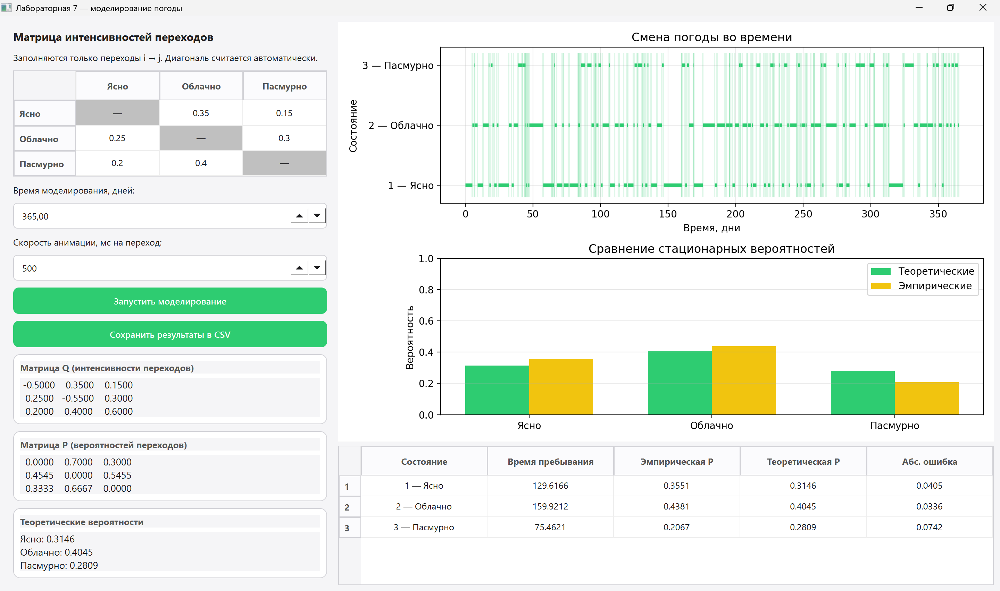

# Лабораторная работа: Марковская модель погоды

В данной лабораторной работе реализована имитационная модель изменения погодных условий с использованием **цепи Маркова**. Модель позволяет наблюдать переходы между состояниями погоды, собирать статистику и сравнивать полученное эмпирическое распределение с теоретическим стационарным распределением.

---

## 1. Постановка задачи

Цель работы — смоделировать динамическую систему «Погода», в которой каждый день погода может находиться в одном из нескольких дискретных состояний:

- **1 — Ясно**
- **2 — Облачно**
- **3 — Пасмурно**

Единица времени моделирования — **1 день**.

Необходимо:

1. Реализовать имитационное моделирование смены погоды.
2. Выполнить визуализацию процесса в реальном времени.
3. Провести статистическую обработку результатов.
4. Найти теоретическое стационарное распределение.
5. Сравнить теоретические значения с результатами моделирования.

---

## 2. Описание приложения

Приложение предназначено для моделирования погодных условий на основе заданной матрицы переходных вероятностей.

Основные возможности программы:

- задание матрицы переходных вероятностей;
- проверка корректности введённых вероятностей;
- пошаговое моделирование изменения погоды;
- отображение текущего состояния системы;
- визуализация накопленной статистики;
- сравнение эмпирического распределения с теоретическим;
- сохранение результатов моделирования в файл.

Интерфейс приложения позволяет наблюдать процесс моделирования в реальном времени, что делает работу модели более наглядной.

---

## 3. Математическая модель

### 3.1. Цепь Маркова

Модель погоды рассматривается как дискретная цепь Маркова.  
Состояние системы в следующий момент времени зависит только от текущего состояния и не зависит от предыдущей истории.

Множество состояний:

$$
S = \{1, 2, 3\}
$$

где:

- $1$ — ясно;
- $2$ — облачно;
- $3$ — пасмурно.

Матрица переходных вероятностей имеет вид:

$$
P =
\begin{pmatrix}
p_{11} & p_{12} & p_{13} \\
p_{21} & p_{22} & p_{23} \\
p_{31} & p_{32} & p_{33}
\end{pmatrix}
$$

где $p_{ij}$ — вероятность перехода из состояния $i$ в состояние $j$ за один день.

Для каждой строки матрицы выполняется условие нормировки:

$$
\sum_{j=1}^{3} p_{ij} = 1
$$

---

### 3.2. Матрица переходов

В качестве тестовой использовалась следующая матрица переходных вероятностей:

| Текущее состояние | Ясно | Облачно | Пасмурно |
|---|:---:|:---:|:---:|
| **Ясно** | 0.70 | 0.20 | 0.10 |
| **Облачно** | 0.30 | 0.40 | 0.30 |
| **Пасмурно** | 0.20 | 0.30 | 0.50 |

Данная матрица показывает, с какой вероятностью погода перейдёт из одного состояния в другое на следующий день.

Например, если сегодня ясно, то завтра:

- с вероятностью **0.70** снова будет ясно;
- с вероятностью **0.20** будет облачно;
- с вероятностью **0.10** будет пасмурно.

---

## 4. Стационарное распределение

Теоретическое стационарное распределение показывает, какую долю времени система в среднем будет проводить в каждом состоянии при достаточно большом количестве шагов моделирования.

Стационарное распределение обозначается как:

$$
\pi = (\pi_1, \pi_2, \pi_3)
$$

Оно находится из системы уравнений:

$$
\pi P = \pi
$$

при условии:

$$
\sum_{i=1}^{3} \pi_i = 1
$$

Для решения используется преобразование:

$$
(P^T - I)\pi = 0
$$

с заменой одного из уравнений на условие нормировки.

Для заданной матрицы переходов было получено теоретическое распределение:

| Состояние | Теоретическая вероятность |
|---|:---:|
| **Ясно** | 0.457 |
| **Облачно** | 0.283 |
| **Пасмурно** | 0.261 |

---

## 5. Алгоритм моделирования

Алгоритм работы программы:

1. Задаётся начальное состояние погоды.
2. На каждом шаге генерируется случайное число.
3. На основе текущего состояния и строки матрицы переходов выбирается следующее состояние.
4. Счётчик дней увеличивается на 1.
5. Обновляется статистика посещения состояний.
6. Рассчитываются эмпирические частоты.
7. Полученные значения сравниваются с теоретическим стационарным распределением.
8. Результаты отображаются в интерфейсе и могут быть сохранены в файл.

Эмпирическая вероятность для каждого состояния вычисляется по формуле:

$$
\hat{p_i} = \frac{n_i}{N}
$$

где:

- $n_i$ — количество дней, когда система находилась в состоянии $i$;
- $N$ — общее количество дней моделирования.

---

## 6. Графический интерфейс

Интерфейс приложения содержит следующие основные элементы:

- панель текущего состояния погоды;
- счётчик дней моделирования;
- блок задания матрицы переходных вероятностей;
- график или диаграмму накопленных частот;
- таблицу сравнения теоретических и эмпирических значений;
- кнопки запуска, остановки и сброса моделирования.

Пример работы приложения:

**Рисунок 1** — Основное окно программы в процессе моделирования

---

## 7. Результаты моделирования

В ходе моделирования были получены эмпирические распределения для разного количества дней.

| Количество дней | Эмпирическое распределение | Теоретическое распределение | Погрешность |
|---:|:---:|:---:|:---:|
| 10  | 0.0638, 0.8570, 0.0792 | 0.3146, 0.4045, 0.2809 | 25.08%, 45.25%, 20.17% |
| 20  | 0.1665, 0.2057, 0.6279 | 0.3146, 0.4045, 0.2809 | 14.81%, 19.88%, 34.70% |
| 50  | 0.1807, 0.3264, 0.4930 | 0.3146, 0.4045, 0.2809 | 13.40%, 7.81%, 21.21% |
| 100 | 0.2904, 0.3704, 0.3392 | 0.3146, 0.4045, 0.2809 | 2.42%, 3.41%, 5.83% |
| 365 | 0.2191, 0.5093, 0.2716 | 0.3146, 0.4045, 0.2809 | 9.55%, 10.48%, 0.93% |

---

## 8. Анализ результатов

По результатам моделирования видно, что при малом количестве дней эмпирическое распределение может заметно отличаться от теоретического. Это связано со случайным характером переходов между состояниями.

Однако при увеличении количества шагов моделирования эмпирические частоты постепенно приближаются к стационарному распределению.

Наиболее часто система находится в состоянии **«Ясно»**, что соответствует теоретическому распределению. Это объясняется тем, что вероятность сохранения ясной погоды в матрице переходов является достаточно высокой.

Также можно заметить, что диагональные элементы матрицы переходов влияют на устойчивость состояния. Чем больше значение $p_{ii}$, тем выше вероятность того, что система останется в текущем состоянии на следующем шаге.

---

## 9. Выводы

В ходе лабораторной работы была реализована имитационная модель погоды на основе цепи Маркова.

Были выполнены следующие задачи:

1. Построена вероятностная модель смены погодных состояний.
2. Реализовано моделирование переходов между состояниями.
3. Выполнен расчёт теоретического стационарного распределения.
4. Проведена статистическая обработка результатов моделирования.
5. Выполнено сравнение теоретических и эмпирических вероятностей.
6. Реализована визуализация процесса моделирования.

Результаты эксперимента подтверждают свойство сходимости цепей Маркова: при увеличении количества шагов эмпирическое распределение стремится к теоретическому стационарному распределению.

Таким образом, разработанная модель позволяет наглядно исследовать поведение случайного процесса и оценивать долгосрочные вероятностные характеристики системы.
